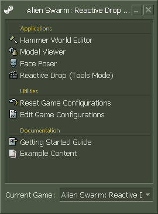

# Overview of the Alien Swarm: Reactive Drop Authoring Tools (SDK)

[&larr; Back](.)

## Installing the SDK

First, if you haven't done this already, [download and open Alien Swarm: Reactive Drop on Steam](https://store.steampowered.com/app/563560/Alien_Swarm_Reactive_Drop/). You need the game installed to use the development tools, and launching the game creates a graphics configuration file that is required for some of the SDK tools to run.

You'll need to [install the Reactive Drop SDK](https://store.steampowered.com/app/593000/Alien_Swarm_Reactive_Drop__SDK/) to get access to the tools used to make maps.

You'll also want to have a text editor such as [Visual Studio Code](https://code.visualstudio.com/), an image editor such as [GNU I.M.P.](https://www.gimp.org/), and [VTFEdit](https://developer.valvesoftware.com/wiki/VTFEdit) for converting textures.

If you want to make 3D models, a tool like [Blender](https://store.steampowered.com/app/365670/Blender/) with the [Blender Source Tools plugin](https://developer.valvesoftware.com/wiki/Blender_Source_Tools). The loading screen images for official missions are made in Blender after importing the map using [the Plumber plugin](https://github.com/lasa01/io_import_vmf/releases).

If you're going to make custom sounds or music, you'll need a tool that can make MP3 files (for music) or WAV files with a sample rate of 44100 Hz (or half or a quarter of that). If you don't have anything like that, you can try [Audacity](https://www.audacityteam.org/). If you want to make a sound that loops, you'll need something like [Wavosaur](https://www.wavosaur.com/) that can write the specific kind of metadata Source Engine expects. If you want to make custom background videos, you can convert your files to BINK (.bik) using [RAD Video Tools](http://www.radgametools.com/bnkdown.htm).

If you're the kind of person who learns by taking things apart, [BSPSource](https://developer.valvesoftware.com/wiki/BSPSource), [Crowbar](https://developer.valvesoftware.com/wiki/Crowbar), and [GCFScape](https://developer.valvesoftware.com/wiki/GCFScape) will be useful to you.

Remember, never share anyone else's work without their permission!

If that sounds like a lot, don't worry. You're not going to use all of these at once, and all of these programs are free.

## What's in the SDK?

- Applications
	1. **Hammer World Editor.** This is the main tool you'll be using to make maps, and the main tool that the rest of this tutorial series will cover.
	2. **Model Viewer.** This tool allows you to view internal details about models such as hitboxes and skeletons, as well as test animations.
	3. **Face Poser.** You will rarely use this, if ever. This tool can be used to set up very advanced choreography with NPCs.
	4. **Reactive Drop (Tools Mode).** This is where you'll go to create custom particle effects and color correction presets.
- **Utilities.** Using these will let you adjust the developer tools to work with a different installation of Alien Swarm: Reactive Drop, such as a total conversion mod. You can safely ignore these unless you have a specific reason to use them.
- **Documentation.** These are quick links to the [Valve Developer Wiki](https://developer.valvesoftware.com/) (a fantastic resource) and the `sdk_content` folder that comes with the Alien Swarm: Reactive Drop Authoring Tools. Additional example content can be found on [the Reactive Drop GitHub repository](https://github.com/ReactiveDrop/reactivedrop_public_src/tree/reactivedrop_public/contentsrc).

One final note: If the tools crash when you try to open them, check `reactivedrop/cfg/video.txt` to see if `setting.defaultresheight` is set to the wrong number. If it looks okay, ask on the forums or in chat!

---

Next page: [Hammer Overview](hammer-overview.html)
