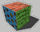
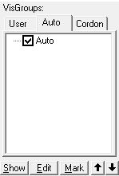

# Overview of the Alien Swarm: Reactive Drop level editor (Hammer)

[&larr; Back](.)

Previous page: [Authoring Tools Overview](authoring-tools.html)

## I just opened Hammer World Editor and I'm scared

Don't worry. This is the correct reaction to have when seeing Hammer for the first time. Let's go over how to control this program.

---

Along the left side, you'll see some icons. These are the main way you'll be interacting with the program.

-  **Selection Tool.** This lets you select objects in the 2D or 3D views. It also lets you draw a box in the 2D views and then press enter to select multiple objects.
-  **Magnify.** You can use this to zoom in and out of the 2D views if your mouse does not have a scroll wheel. Hammer is *old*.
-  **Camera.** This will allow you to move the 3D view. Most mappers will instead press Z to move the view with their mouse, scroll up or down to move the camera forward and backwards, or use WASD and arrow keys to move and rotate the 3D view's camera.
-  **Entity Creation Tool.** This tool lets you place point entities like enemies, spawners, props, logic, and lighting. You'll use this a lot.
-  **Block Creation Tool.** This tool lets you draw a block by dragging on the 2D views, similar to how you can select multiple objects with the Selection Tool. Blocks (also called "brushes") are used for floors, walls, ceilings, terrain, and triggers. Anything that isn't a point entity is a brush entity, and vice versa. You'll use this a lot.
-  **Texture Application Mode / Face Edit Sheet.** This tool lets you assign and align materials on the sides of brushes. This is also how you make displacements, which are useful for bumpy terrain and custom texture blending.
-  **Apply current texture to selection.** If you're in a hurry, you can change every side of a brush to have the last-used material at the same time.
-  **Apply decals.** Decals are things like bullet holes, graffiti, paint, and stains.
-  **Apply overlays.** Overlays are like decals, but more complicated. (And also more powerful!)
-  **Clipping tool.** Lets you cut brushes into pieces. Useful if you want to make a shape Hammer doesn't give you access to by default.
-  **Vertex manipulation.** Allows you to edit the individual corners of a brush. Beware: Brushes need to be convex. Bad things will happen if you make a concave brush.
-  **Send selected model to Maya.** This doesn't do anything if you don't have Maya installed, and I don't own Maya, so I can't tell you what it does.

---

At the top, there are menus (File, Edit, Map, etc.) and some buttons. These buttons affect how things look. You can hover over them with your mouse to see a description of what they do at the bottom of the screen. If Hammer starts looking or acting weird after you press a key on your keyboard, check these buttons.

---

On the right, there are several groups of buttons.

**Selection Mode**

In most cases, you'll want "Groups" to be enabled. If you need to work on something that's in a group without ungrouping it or work on a brush that is part of an entity without affecting other brushes in the same entity, pick Objects or Solids.

**Textures**

This shows you the material that is currently selected. This material is what gets used by most of the tools on the left. Click Browse to search through available materials. Click Replace if you have a material you want to completely replace with another.

**Filter Control**

You can temporarily hide categories of objects from your map, which might be useful if they're getting in the way while you're working on something specific. You can either define your own categories and add objects to them or use the automatic categories that Hammer provides, like "Lights" and "Triggers".

**New Objects**

This lets you fine-tune what the Entity and Block Creation Tools do. You can create shapes other than cubeoids, change what entity type gets created, and use the buttons as shortcuts for creating brush entities out of world brushes or vice versa.

---

Next page: [Your First Map](your-first-map.html)
