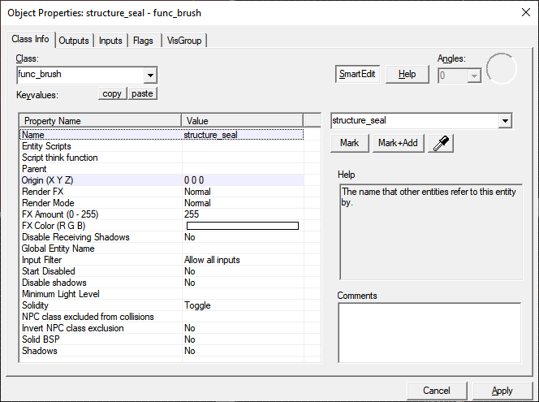

# Creating your first Alien Swarm: Reactive Drop map

[&larr; Back](.)

Previous page: [Hammer Overview](hammer-overview.html)

## Let's get started

First, let's create a new map file. **File &rarr; New**.

**Save your map.** The filename you choose will be what your map is called by the game. It should be all lower-case letters and numbers with no spaces (hyphens and underscores are okay) and be at most 32 characters long.

Hammer is prone to crashes, and you don't want to lose your progress. Get into the habit of saving after you do anything substantial.

Select the **Block Creation Tool** and draw a box in the 2D views. Drag the handles so it is at least 1000 units in each dimension, then press enter when you're satisfied.

Switch back to the **Selection Tool**, right click on the block you just made in the 2D view, and select **Make Hollow**. Type `-32` and press enter.

You should now see the hollow box you just made in the 3D view. It'll have whatever texture you had selected at the start applied. For now, we're going to leave that alone.

Select the hollow box and press Ctrl+T to create a brush entity. Change the class to `func_brush` and press enter.

Select "Name" on the property list and in the box to the right type `structure_seal` and press enter.

*Any `func_brush` with a name starting with `structure_` can act as the walls of a room. Every entity in your level (except the `structure_` brushes) needs to be inside a room. Most Alien Swarm maps only have one "room" as far as the game engine is concerned.*

Hover over the 3D view and press the down arrow key until you can see the floor of the box.

Activate the **Entity Creation Tool** and click on the floor. If what appears doesn't look like a green IAF marine, switch to the **Selection Tool** and double-click it. Change the class to `info_player_start` and press enter.

Press **F9** and switch to **Expert** mode (you'll only need to do this once). From the configuration list, select **Fast**, and then press **Go!**

If you see yellow text briefly appear and the game does not open, check to make sure you followed the instructions about `structure_seal` correctly.

*You've just made your first Alien Swarm: Reactive Drop map, and you're playing it right now.*

---

Next page: [Basic Lighting](basic-lighting.html)
